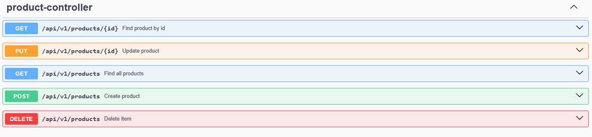
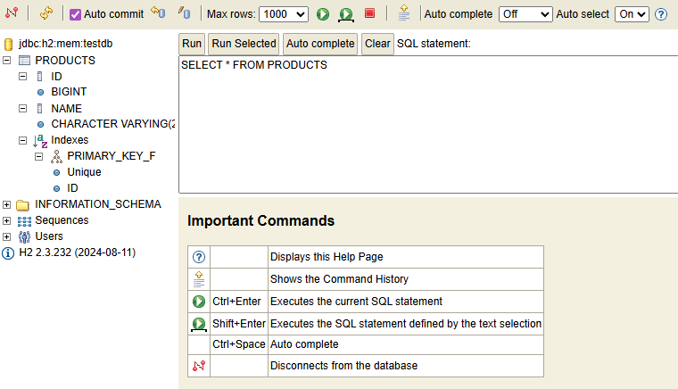

# Project: FirstRestAPI

## 📌 Description
This is a functional RESTful API developed using Java and the Spring Framework. The application manages a resource (Products) and demonstrates the implementation of CRUD (Create, Read, Update, Delete) operations with database.

## 🛠 Tech Stack
- **Java 17+**
- **Spring Boot** (Web, Data JPA, H2 Database)
- **Maven**
- **Swagger/Postman**

## ⚙️ How to Run
1. Clone: `git clone https://github.com/nqxssnn/FirstRestAP.git`
2. Navigate to the project directory:.
3. Run the FirstRestApiApplication.java file from your IDE (IntelliJ IDEA).
4. Access points: `http://localhost:8080` and Swagger `http://localhost:8080/swagger-ui/index.html#/`

## 🚀 Use Cases & API Testing

### 1. Find Product By Id (GET)
- **URL:** `/api/v1/products/{id}` 
- **Description**: Fetches a list of specific product.

### 2. Update an Existing Product (PUT)
- **URL:** `/api/v1/products/{id}`
- **Description:** Modifies data of an existing resource.
- **Body:** `{
  "name": "Modified Product"
}`

### 3. Get All Products (GET)
- **URL:** `/api/v1/products` 
- **Description**: Fetches a list of all products.

### 4. Create a New Product (POST)
- **URL:** `/api/v1/products`
- **Body:** `{
  "name": "New Product"
}`

### 4. Delete a Product (DELETE)
- **URL:** `/api/v1/products/{id}`

## 📊 Database Verification
URL: `http://localhost:8080/console`
- **JDBC URL:** `jdbc:h2:mem:testdb`
- **User:** `sa`
- **Password:** (leave empty)

# Preview

